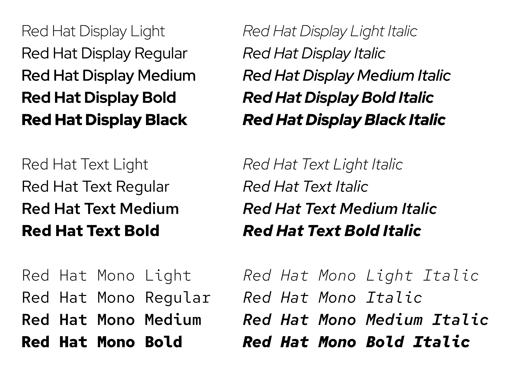

# Red Hat Fonts Files

## Designers

### Jeremy Mickel

Jeremy Mickel runs MCKL, a Los Angeles-based design studio publishing original fonts and providing design services for clients worldwide. Founded in 2012, MCKL has collaborated with design studios, corporations, and social organizations around the world to produce custom typeface and logo solutions. Mickel's work has been recognized by the Type Directors Club and the AIGA, and he has taught at RISD and the Minneapolis College of Art and Design.


## About Red Hat Display and Red Hat Text



Red Hat is an enterprise software company with an open source development model. We use collaboration and knowledge sharing to craft better, more reliable, and more adaptable technologies. How our words look is as important to our brand voice as the words we choose. That’s why we developed a type family that’s all our own.

The Red Hat type family is produced in 2 optical sizes, in a range of weights with italics. The fonts were originally commissioned by Paula Scher / Pentagram and designed by Jeremy Mickel / MCKL for the new Red Hat identity.

Red Hat is a fresh take on the geometric sans genre, taking inspiration from a range of American sans serifs including Tempo and Highway Gothic. The Display styles, made for headlines and big statements, are low contrast and spaced tightly, with a large x-height and open counters. The Text styles have a slightly smaller x-height and narrower width for better legibility, are spaced more generously, and have thinned joins for better performance at small sizes. The two families can be used together seamlessly at a range of sizes.

As part of Red Hat’s commitment to open source software, the fonts are made available for use under the SIL Open Font License.

## Installation

The OTF or TTF folders contain the font files used by most user operating systems.

If you are running Homebrew, you can install the fonts with the following:
```
brew cask install homebrew/cask-fonts/font-redhat
```

## Bug reports and improvement requests

If you find a problem with a font file or have a request for future development of a font project, please [create a new issue in this project's issue tracker](https://github.com/RedHatOfficial/RedHatFont/issues).

## Self Host Fonts Available From Red Hat

Since all the fonts available here are licensed with permission to redistribute, subject to the license terms, you are able to self-host the fonts in this project.

## Licensing

Copyright 2019 Red Hat, Inc.

Licensed under the SIL Open Font License, Version 1.1, with Reserved Font Name Red Hat.

The SIL OFL does not grant any rights under trademark law and all such rights are reserved. Modified versions must be renamed to avoid use of any Red Hat trademarks, including but not limited to "Red Hat".
